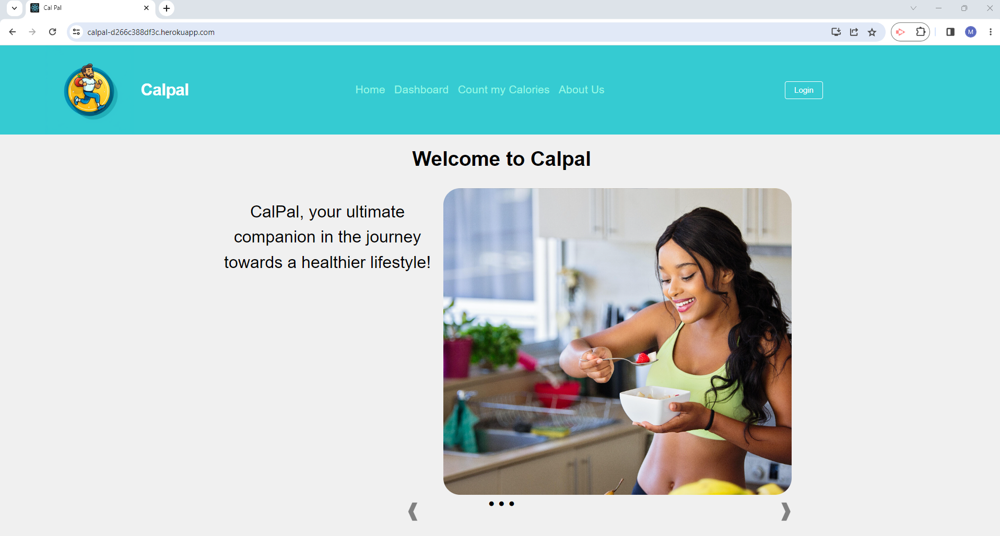
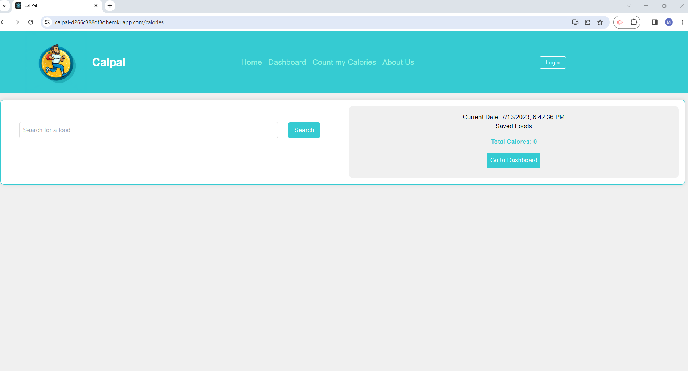
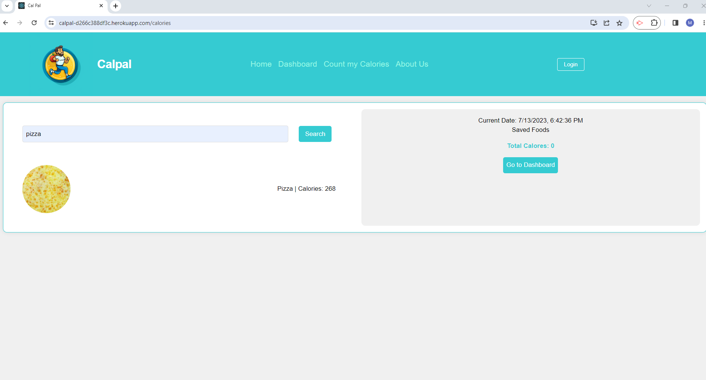
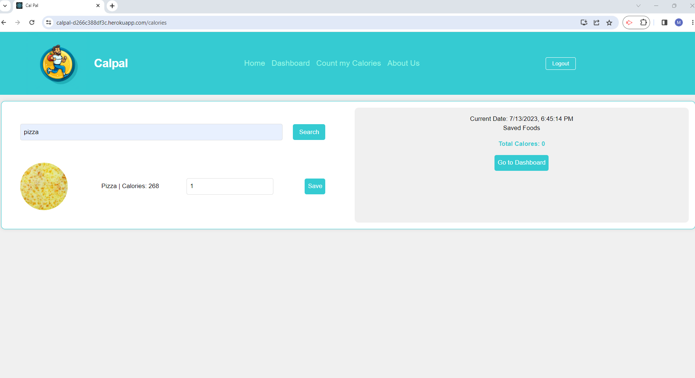
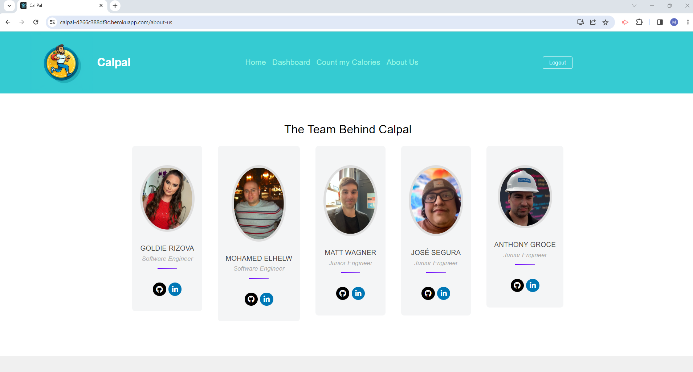

## Description
CalPal is a calorie counting web application that allows a user to search for foods via the Edamam API and save the calories of their logged foods to their account.  
Users can see their logged calories for the week rendered as individual days listed in an easy to digest bar graph in their dashboard.
The idea is simple, fast, and easy.

## Usages
By creating CalPal, our goal is to simplify the process of calorie tracking and provide a user-friendly tool that fits seamlessly into people's daily lives. We aim to alleviate the stress and confusion often associated with calorie counting by leveraging technology to streamline the process.
We also wanted to build a scalable project, where we knew we could succeed, accomplish the mvp quickly, and have time to add complexity later.

## used Technologies
 ant design , Tailwind , Dayjs , React , Apollo , bycrypt , Express , Graphql, Mongoose, Nodemon , JWB, Heroku , Github , Vs-code

## github link
https://github.com/Bit-Bandits/client
https://github.com/Bit-Bandits/server

## Heroku deployed app

deployed front-end :https://calpal-d266c388df3c.herokuapp.com/
deployed back-end: https://cal-pal-server-273e253c14e5.herokuapp.com/graphql 

 ## Credits
  - Mohamed Elhelw
  - Anthony Groce
  - José Segura
  - Goldie Rizova
  -Matt Wagner

## License
MIT License

